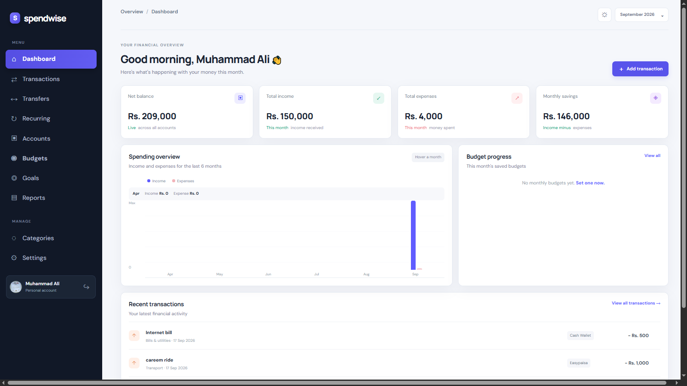
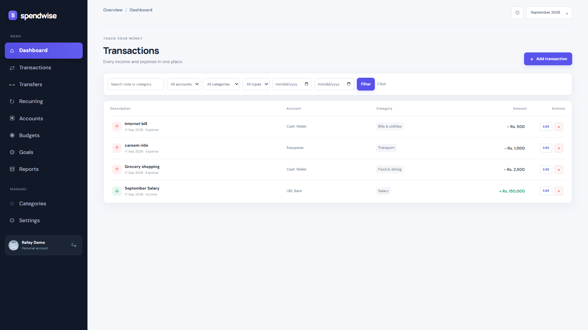
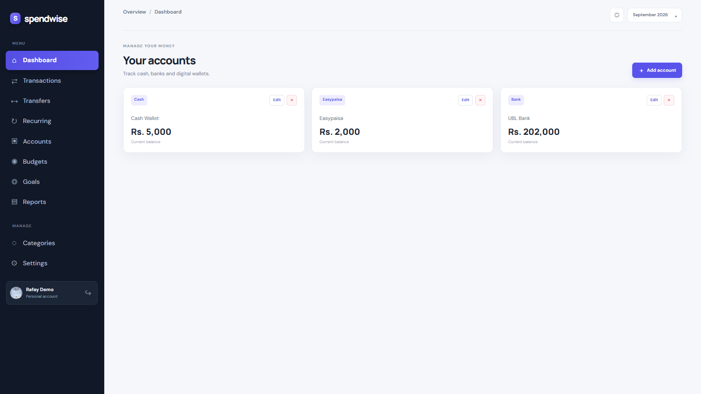
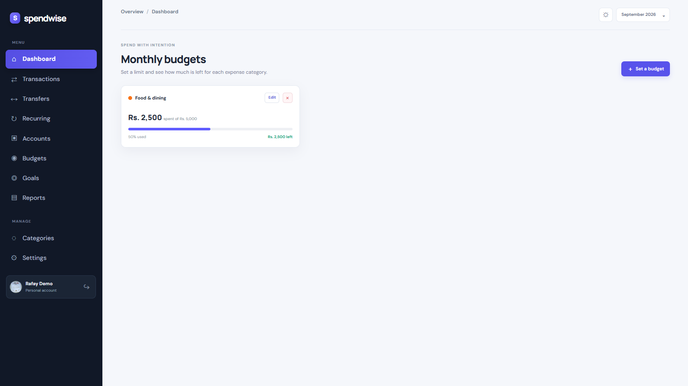
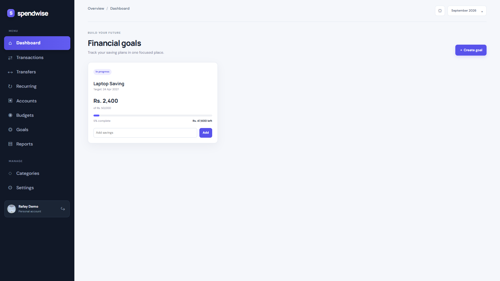
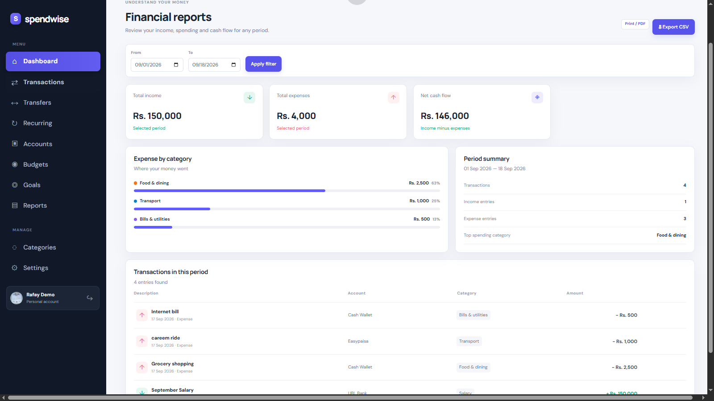
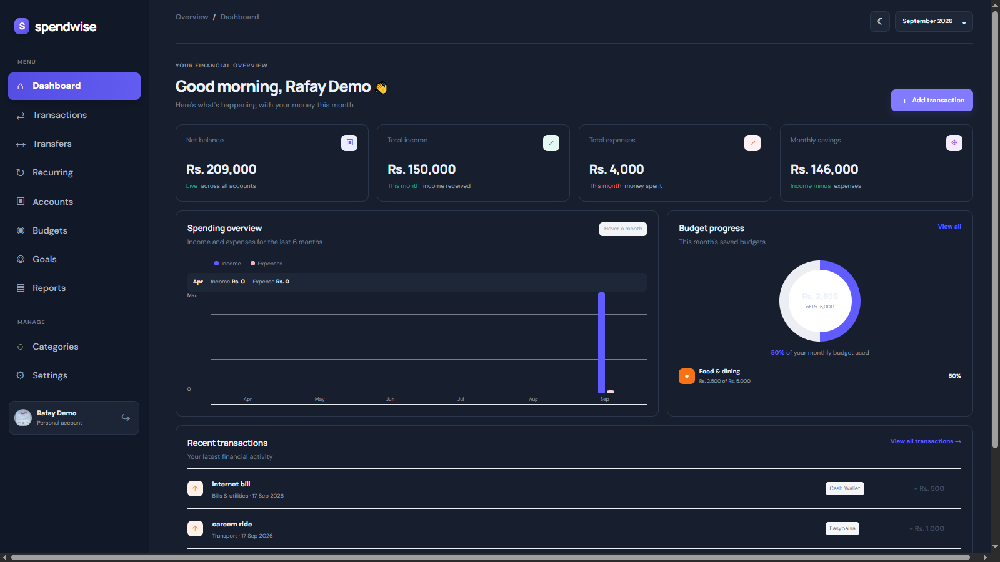

# SpendWise — Personal Finance Manager

SpendWise is a full-stack ASP.NET Core MVC personal-finance application for tracking money, setting budgets, saving toward goals, and understanding spending habits.

## Features

- Secure registration, login, logout, password change, and user-specific data
- Admin dashboard for the configured administrator
- Accounts: cash, bank, Easypaisa, JazzCash, and calculated balances
- Income, expense, search, filters, pagination, and receipt-image uploads
- Account-to-account transfers without changing net balance
- Categories, monthly budgets, overspending alerts, and recurring transactions
- Financial goals with progress tracking and savings contributions
- Dashboard with live calculations and interactive spending chart
- CSV export and print-friendly reports that can be saved as PDF
- User settings: display name, avatar, currency, theme, and alert preferences
- PWA manifest/service worker support for installable-app behavior
- Responsive light and dark interface

## Tech Stack

- .NET 8 / ASP.NET Core MVC
- Entity Framework Core 8
- SQL Server
- ASP.NET Core Identity
- Bootstrap, Razor, CSS, and JavaScript
- xUnit

## Run Locally

1. Open PersonalFinanceManager.sln in Visual Studio 2022.
2. Update the SQL Server connection string in PersonalFinanceManager/appsettings.Development.json or use .NET User Secrets.
3. Run the project with F5.
4. Create an account from the registration page.

The application initializes its development tables automatically on first run.

## Tests

Run: dotnet test

Current automated checks cover goal progress, savings calculation, and account balance view-model behavior.

## Screenshots

### Dashboard

### Transactions and accounts

### Budgeting and goals

### Reports and dark mode

## Future Enhancements

- Email verification and password-reset email delivery
- Server-generated PDF export
- Bank API integrations
- Richer admin moderation tools
